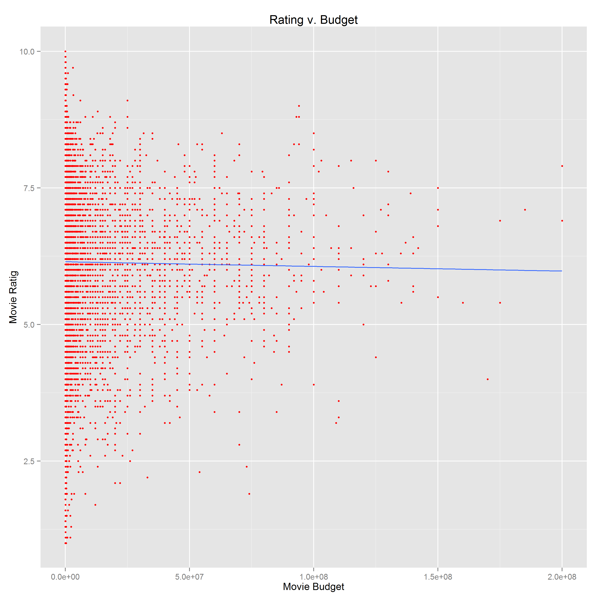
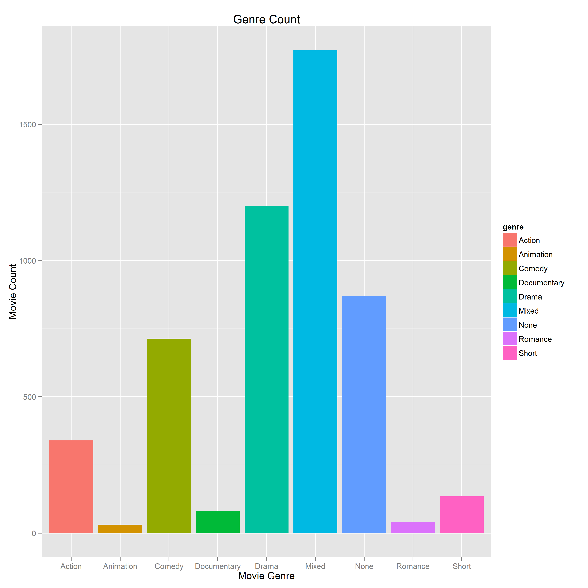
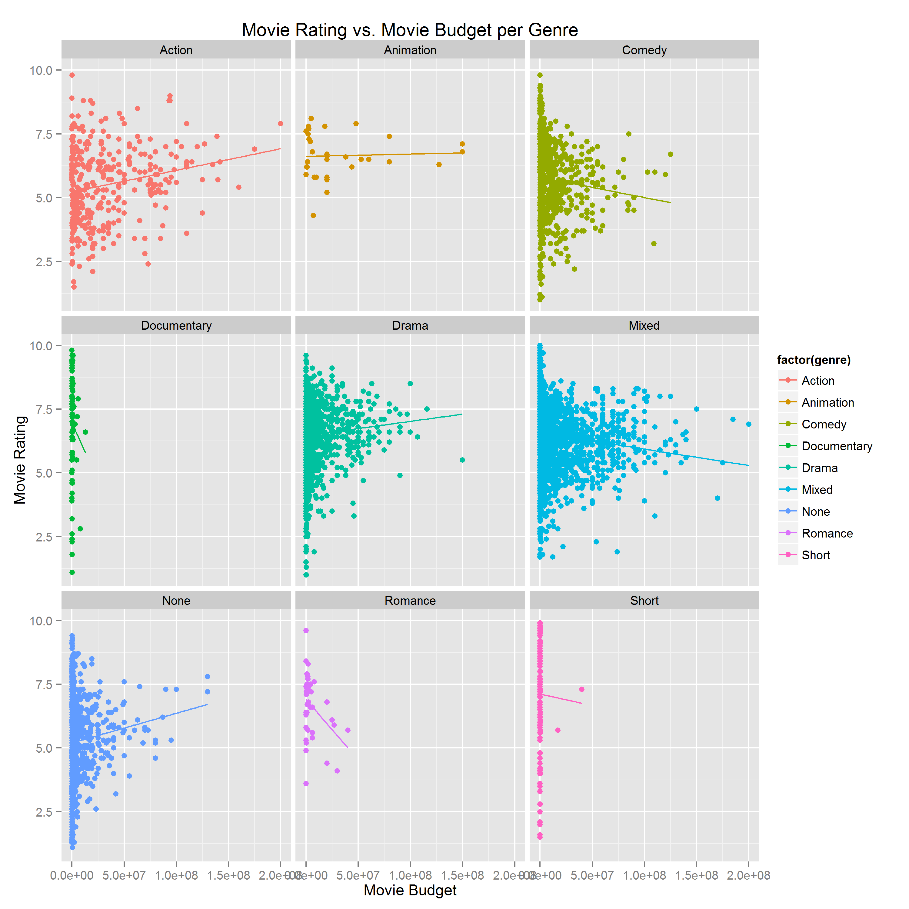
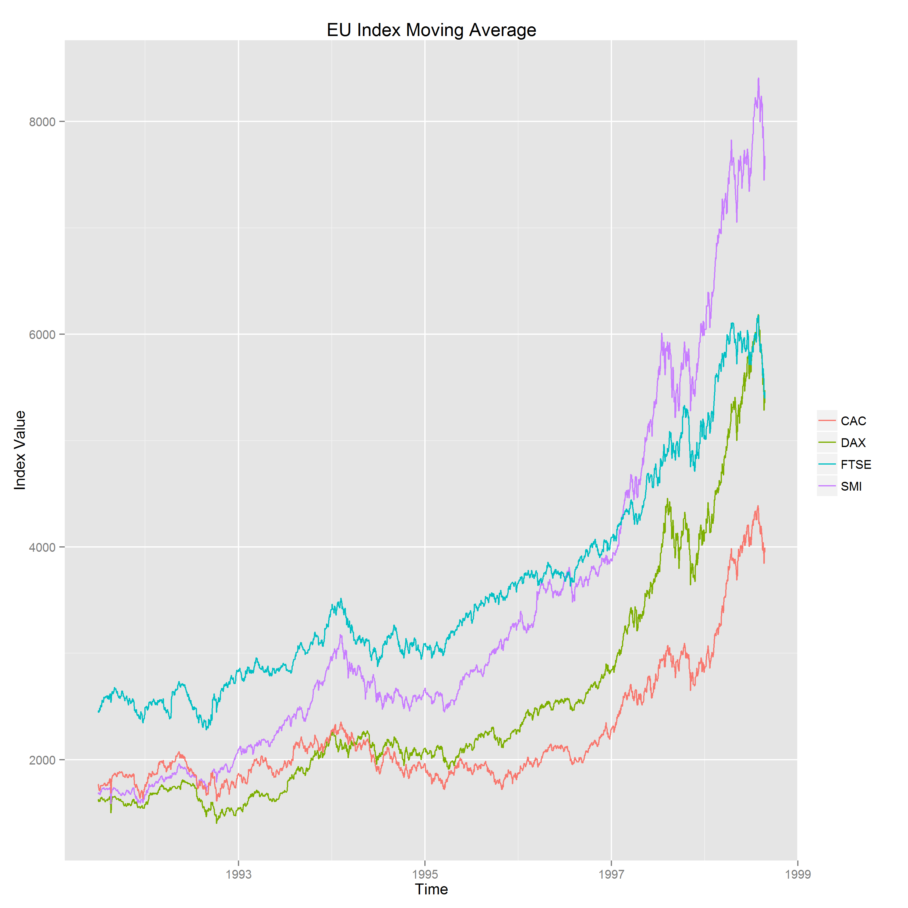

Basic Charts
==============================

## Instructions ##

The following packages must be installed prior to running this code:

-'ggplot2'

The following data set must be imported prior to running this code:

-'movies'
-'EuStockMarkets'

## Discussion ##

Question 1 Discussion:

This is a scatterplot of ratings vs. budget. I set the parameter of the size of the points to be 1 since there were more many data points. Also I set the color to  red to improve visibility of the points.  Additionally, I fit a linear regression line, geom_bar(), to indicate there, from the scatter plot, there is no correlation between movie budget and movie rating.

Question 2 Discussion:

This is a bar chart counting the number of Action, Animation, Comedy, Documentary, Drama, Mixed, None, Romance, and Short. For color and legend, I used the build-in ggplot color palette. Each color represent a different genre. 

Question 3 Discussion:

There are eight scatter plots of ratings versus budget. Each scatter plot represent an genre. The color are build in ggplot palette. For each scatter plot, I fitted a regression line geom_bar(). From this regression line, I can see that for action movies, there is a linear correlation between budget and rating. However for romance, there is a negative correlation. 

Question 4 Discussion:

This is a plot of stock indices versus time. I plotted CAC, DAX, FTSE, SMI versus time. The colors are build-in ggplot palette. Since ggplot uses layers, I added each line to the original plot. Additionally I used theme(legend.title=element_blank()) to remove the title of the legend. 

