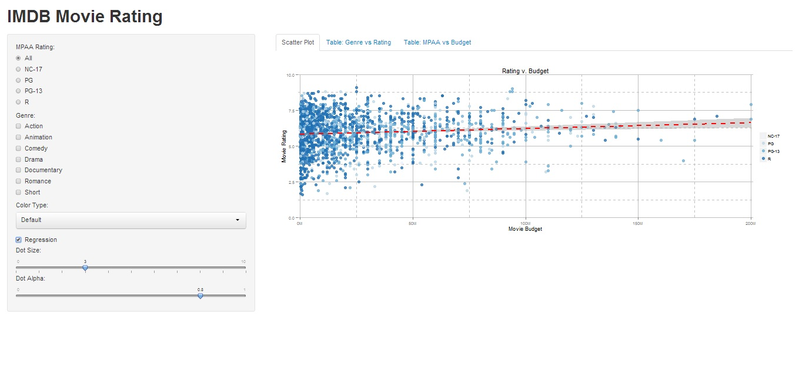

Homework 2: Interactivity
==============================

| **Name**  | Yi He  |
|----------:|:-------------|
| **Email** | yhe27@dons.usfca.edu |

## Instructions ##

The following packages must be installed prior to running this code:

- `ggplot2`
- `shiny`
- `plyr`
- `scales`


To run this code, please enter the following commands in R:

```
library(shiny)
shiny::runGitHub('msan622', 'heyi87', subdir='homework2')
```

This will start the `shiny` app. See below for details on how to interact with the visualization.

## Discussion ##

First I removed the title for the legend. Since the legend is  MPAA, with the tool box on the left of the interface, this provides unnecessary and repetitive information for the user. Next, since the background color is a dense grey while the defaults for the color of the points are lighter, the user often cannot see all the points. Therefore, I changed the color of the scatter plot background to white.  Second, I changed the grid line of the plot. The default grid line was difficult for the user to distinguish between points and grid line. Therefore, I defined the major and minor grid line to be a dense grey color. To differentiate major and minor grid line, I changed the major grid line to be a solid line while the minor grid line as dashes.  Since the default are in tens of millions, I defined a million formatter function. This function changes any number into the million units and adds the letter ‘M’ at the end. With this function, I changed the unit of the x-axis to number and the letter M. Also, for the margin between axis labels and the plot, I decreased the margin to show more of the data. 

Next, I added a check box for regression. This is important if the user wants to see a model that fit the data. The regression line also includes the standard error. The red color stands out against all of the data points in the plot. Without the regression line, the user will have difficulty understanding the relationship between rating and budget. Based on the regression, there is a clear correlation between rating versus budget for action movies. However, there is lesser correlation between budget and animation movies.  



Since the scatter plot showed rating versus budget, I think the user would also be interested in the relationship between movie genre and ratings. Therefore, I made a table comparing genre versus ratings. Each movie’s rating was divided into subgroups of 0-2, 2-4, 4-6, 6-8, and 8-10. The user can subset by ratings and genre, and the table will automatically update the data. This is an important table since it gives another important perspective for the overall data set. Since ratings and genres are columns on the left side of the interface, user will most likely want to know their relationship.


I created a table to count MPAA rating versus budget. The budget are grouped into groups of 0-25 million, 100-150 million, 25-50 million, and 50 to 100 million. This table will automatic update the data collected when the user subset the data at the right panel. This is useful since the user can find an exact number to the count of movies within a particular group of MPAA rating or budget. 


