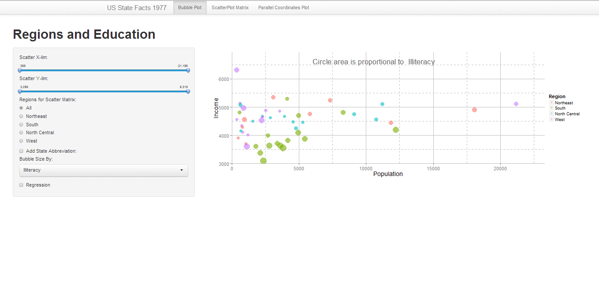
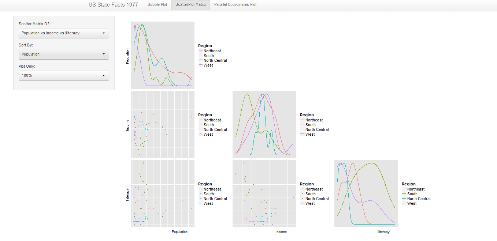
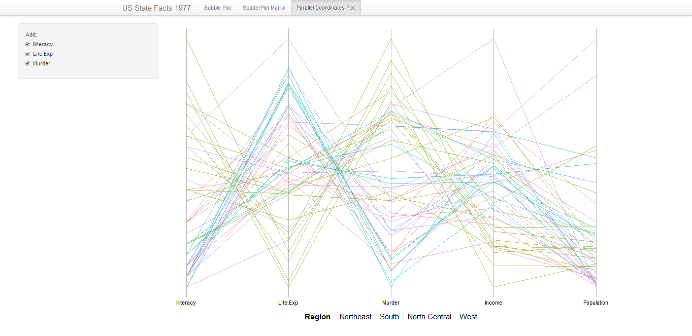

Interactivity with Advance Plots
==============================

## Instructions ##

In order to run my Homework 3 Interactivty, please install 'ggplot2', 'shiny', 'grid', and 'GGally'

library(shiny)

shiny::runGitHub("R_Visualization", "heyi87", subdir = "InteractivityWithAdvancePlots")

## Discussion ##

### Technique 1: Bubble Plot ###
In this technique, I choose to use a Bubble Plot. I wanted to show the relationship between income and population. I used the income and population column as the base for my bubble plot. However, other column such as: illiteracy, life expectation, and murder rate can be added by the user to be proportional to the size of the bubble. These three columns are related to income and I wanted to see if I can see a relationship. I encoded the region column to determine the color. This column is useful since there are only four categories and it provides an intuition to the group of states that are related to each other. In my plot, all the Southern states have similar characteristics and they are grouped in the bottomed left. I used the zoom customization to allow users to zoom in and out of the plot to get a better look at the data. In addition, I allow the user to filter by region. If a user want to compare Northeast versus the rest of the United States, the user can click on Northeast and the color will differentiate between Northeast and all other states. I added state abbreviation so the user can label the state abbreviations on the data point.  I added the ability for the user to pick the bubble size by murder, life expectation, or illiteracy. Finally I added a regression line with predicted confidence interval to show correlation between income and population. 

Some customizations of the plot are changing the background color to white to provide better contrast with the data points. Second, changing the grid since the default grid was difficult for the user to distinguish between points and grid. I changed the major line to be solid line while the minor to be grid line. I increased the margin between axis labels and the plot to show more data. I added annotation to show which column is changing the size of the bubble. 

Some conclusions about this plot are that southern states are very similar in population and income. They have similar size bubbles for murder, illiteracy and life expectation and they are similar in size and income level. However western states are spread apart in those categories. However all of the western states have a small population except for California. California is an outlier with large population and income. Other regions are also spread out with New York being similar to California with high income and population. 

### Technique 2:  Scatterplot Matrix ###

I picked scatterplot matrix instead of small multiples since scatterplot matrix showed better relationship between many variables. I picked this technique since in the previous plot, the bubble plot, I showed the relationship between income and population with different bubble size for murder rate, illiteracy, and life expectation. This plot will show all five columns and their correlation with each other. The user can pick whether they want to let the scatter plot matrix consist of population and income, or population income and illiteracy, or population income and life expectation, or finally population income illiteracy life expectation and murder rate. I picked these five columns because they should be similar in their relationship to wealth. In additional, I picked the region column to encode the data. The user can pick which region to filter in the bubble plot and they are linked. I will discuss detail sorting in the in the interactivity section.
Customization involves sorting and allowing the user to pick which column to add to the scatterplot matrix. Also, I added a legend and removed the axis since this plot is to show correlation and not the exact value of points. I tried to add some ggplot() features, changing background color, and reformatting the axis, but since this is part of the GGally library ggpairs() did not allow for fluent transition. Therefore, I only used ggpairs() customization which was sufficient to make the point.
Some immediate conclusions include that states in the northeast have a wide range of income but similar overall literacy rate. States in the north central and the west have very good illiteracy rates. All four regions have very similar life expectation rates. As for murder rates, northeast have much lower murder rates than southern states.

### Technique 3:  Parallel Coordinate Plot ###

This technique gives an overview of grouping of regions and how they correlate with each other for different columns. I picked the same column as I used in the bubble plot: Population, Income, Murder, Life Expectation, and Illiteracy. I wanted to see the relationship between population and wealth. In my opinions, the last four columns are related to wealth. The color is determined by region, there is interaction that if the user picked to compare northeast, south, north central, or west versus all other region, this plot will also be filtered. I removed the numerical values on the axis since this plot shows only relationships between groups and the exact values are no necessary. Also, I removed the background color and the grid to improve the color density of the plot. I customized the plot to allow user to pick columns to be included in the parallel coordinate plot, but I have a base of population and income. This is the same base as the bubble plot in the first section. 

## Interactivity ##

On the top panel, the user must pick which plot to look at. The user has the choice of looking at bubble plot, scatterplot matrix, or parallel coordinates.
 In the bubble plot, I implemented zooming and filtering. The user can zoom by changing the value of the x-axis and y-axis. This zoom allows the user to look at the overview and then detail. The user can also filter in the bubble plot. The user can pick which region to compare to the rest of the regions. The user can pick: northeast, south, north central, or west to compare to the rest of the regions. When the user click on the region, the plot will change into two categories, and will show only two colors. This filtering technique is linked to all three plots. The user can also add abbreviation of the state, change the bubble size by murder rate, illiteracy rate, or life expectation and add a regression line.

For the scatter plot matrix, I implemented filtering and sorting.  The filtering comes from the first section, since filtering is linked. The user can pick which columns to create a scatter matrix and sort by. Sort by will sort the entire data frame base on that column. This sort will not change the scatter plot matrix initially. The user must click on ‘plot only’ and which percentage of the data to plot. For example, if a user clicked ‘murder’ and plot only ‘50%’, the scatter plot matrix will display the top 50% of states with the highest murder rate. Both of these techniques are overview and then look at the context. 

As for the parallel coordinates plot, the user can pick which column to include in the plot. There is a base of income versus population similar to the bubble plot, but the user can include illiteracy, life expectation and murder.

