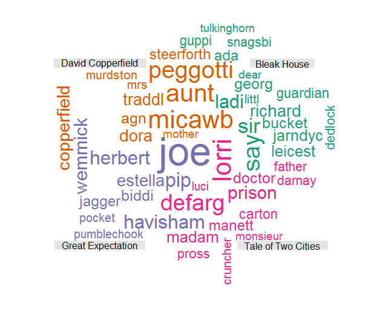
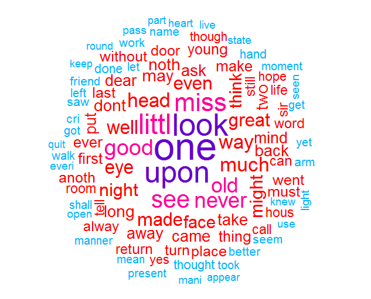
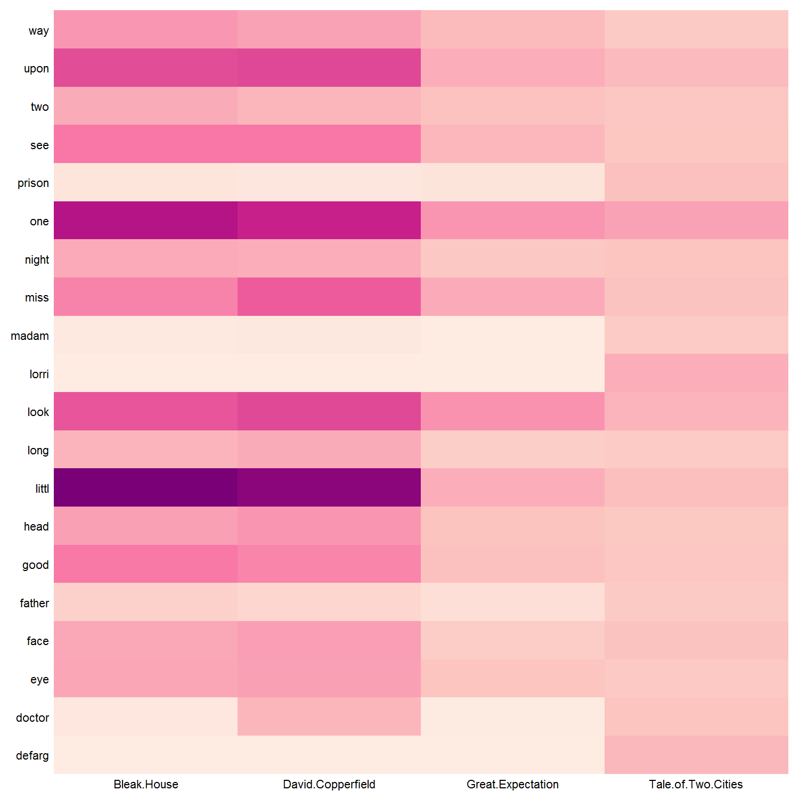
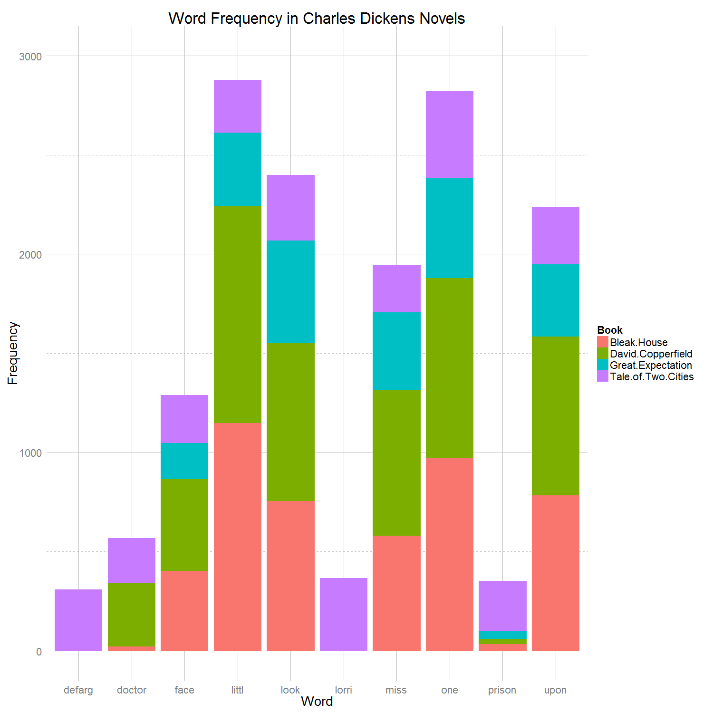

Text Analytics with Shiny and R
==============================

## Instructions ##

The following packages must be installed prior to running this R script:
```
tm,SnowBallC, wordcloud, ggplot2, reshape, plyr, scales
```

To run this code, please enter the following commands in R:
```
source_url("https://raw.githubusercontent.com/heyi87/R_Visualization/Text Analytics with Shiny and R/YiHW4.R")
```
You would need to download all of the data in Homework 4. Please create a folder call data and put all four text files into the data folder. The text files contain:
BleakHouse.txt
DavidCopperfield.txt
GreatExpectation.txt
TaleOfTwoCities.txt

## Discussion ##

I am a fan of Charles Dickens'. Charles Dickens is a famous 19th Century English writer considered to be the greatest author of the Victorian era. I wanted to study Charles Dickens' writing style, therefore I picked four novels: Bleak House, David Copperfield, and Great Expectation. The data set comes from Project Gutenberg. First I decided to use a comparison cloud and a commonality cloud to study the similarity and difference of words for each of the four novels. Next, I used a heat map to look at the frequency of the most popular and unique words in each of the four novels. Finally, I used a bar plot to study the popularity of each word between texts. 

## Text Clean-Up ##
1. Import the text files as UTF-8 and read the text into R as plain texts
2. Change all text to lower characters
3. Remove all punctuation but perserve intra word dashes
4. Remove all numbers
5. Remove English stop words
6. Remove common and insignficant words
7. Stem each word with the English stemmer
8. Remove white spaces
9. Clean.text function removes any remaining punctuation from the removePunctuation function

## Word Cloud ##

I used two word clouds. The first is a comparison cloud which picked the most frequent words in each novel. This is an interesting plot since it the most frequent unique words for each novel. For example, in The Tale of Two Cities, the most popular words are ’lori’ and ‘defarg’ and they are important characters in the novel. Since all four novels contain many terms, I only plotted the first 50 most frequent unique words. I used medium data-ink ratio and high data density since this is a word cloud plot and I want to show as much data as I can to show comparison. Second, most published word clouds have high data density and medium data-ink ratio.


The second word cloud is a commonality cloud. This plot shows the most common words are ‘one’. Since Dickens' novels are introspective, this makes sense. Second, ‘miss’ is a common word. This makes sense since 19th century English people are often polite. Again this is word cloud has high data-ink ratio and high data density since this word cloud is reflective of most published word clouds. 


#Heat Map
In this plot, I picked the top twenty words and plotted it against the four novels. The colors represent how frequent each word appears in the novel. For instance ‘littl’ appear more in Bleak House and David Copperfield than Great Expectation and Tale of Two Cities. This plot provides valuable insight. The word ‘prison’ is a popular word in Tale of Two Cities since this novel is about the French Revolution and many characters go to prison, however the word ‘prison’ is not popular among the other three novels. Also the word ‘madam’ is a popular word in The Tale of Two Cities since the novel takes place in France rather than the other three novels. The word ‘one’ is important for Bleak House and David Copperfield since both of those novels follows one character closely.
To generate this plot, I melted the data set and picked the top 20 words. Next, I remove the grids and change the scale. I gathered a new palette from color brewer and flip the coordinate. I removed the legend. I tried to increase the size of the font but due to the number of terms, they overlapped. I tried to use different colors instead of different shades of red, but that resulted in confusion. This plot has high data-ink ratio, but since this is a heat map, a high data-ink ratio is acceptable. As for the data density, this is at the level deem acceptable for a heat map.



#Frequency Bar Plot#
This plot compares the most frequent words in all four novels. Words such as ‘littl’ and ‘one’ are most frequent among all four novels while both ‘prison’ and ‘lorri’ are the least frequent. This plot provides valuable information for comparing and contrasting terms throughout the novels. In this plot, I removed the background color and re-format the grid lines. Next I removed the tick marks and changed the limit of the y axis. This plot shows acceptable level data-ink ratio for a bar plot, and good data density. I tried to color the bars as one color, but that type of bar plot showed limited information.



