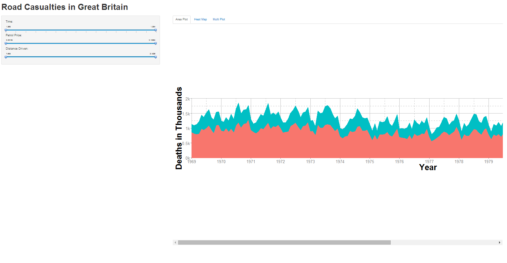
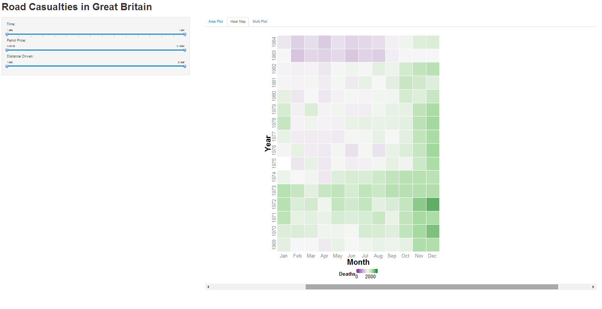
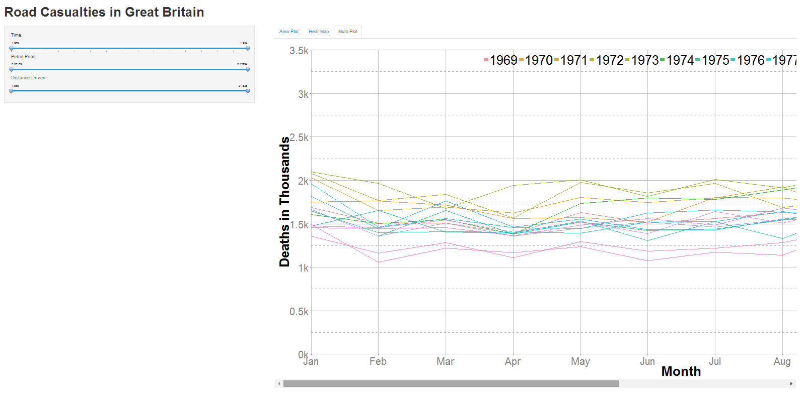

Homework 5: Time Series Visualization
==============================

| **Name**  | Yi He  |
|----------:|:-------------|
| **Email** | yhe27@dons.usfca.edu |

## Instructions ##

In order to run my shiny application, please install:
`shiny`
`ggplot2`
`grid`
`scales`
`data(Seatbelts)`
To run the code please type below into your R-Browser:
`shiny::runGitHub("msan622", "heyi87", subdir = "homework5")`

## Discussion ##

I combined static and interactive options for my data visualization assignment.

#Data - Seatbelts#

For this data set, I was interested in the number of car accident deaths versus time. I wanted to see whether the compulsory wearing of seat belts introduced in 1983 decreased the number of car accident deaths.

#Stacked Area Plot#

This is a stacked area plot of front and rear seat passenger deaths. In this interactivity, the user can zoom into the plot by year, petrol price, and distances traveled. The blue is the rear passenger death and the red is the front passenger death. 
Some changes I made to this plot includes, changing the x-axis to include only year variable and y-axis in thousands 'k' number of deaths. I change the background to white and change the grid lines for easy viewing. I also increase the size of the labels and increase the size of the plot in interactivity in ui.R . In addition, I input the legend to the upper right corner of the plot to improve data density and data-ink ratio. 
In this plot, there is reasonable lie factor. The data is a area plot in which the integral of the area should be the total deaths through time. Data-ink ratio and data density is high and reasonable. There's is significant data on the plot and the area is usually 50% covered. 

#Heat Map#

This is a heat map plotting the total death by car accidents. The year is the y axis and the month is in the x axis. This allow for side by side seasonality comparison. The user can zoom into the plot by year, petrol price, and distance traveled. 
Some changed I made to this plot include: changed the color range for the heat plot, change the x scale to months, change the y axis to years, moving the legend to the bottom, change the background color. 
In this plot, there is reasonable lie factor. The plot is based on number of deaths. Since the heat plot shows a color range, there might be some lie factor. However, all heat maps contain some level of lie factor. In addition, the data-ink ratio is very high but it is same as every other heat map. Finally the data density is high due to the nature of the heat map.

#Multiline Plot#
This is a multiline plot, each line is a year. The x axis is month and y axis is the number of total deaths. This shows seasonality trend of the number of deaths. 
Some changes I made to this plot include: Changing the x axis labels to month, the y axis to thousands of deaths. I also changed the label to the upper right corner of the plot, the text size of the labels, and the color of the line for each year. I also change the back ground color to white and change the grids for the user to view it easier. 
In this plot, there is reasonable lie factor. The line plot is represented of the data. Additionally, there is medium data density due to the having wide range of years in the plot and high data ink due to the nature of the multi-line plot. 

#Improvements#
If I had more time, I would implement filtering and brushing in my interactivity. Additionally, I would improve the overall format of the plots. Due to too many data points, the plot needs to be larger but interactivity labels are small.
