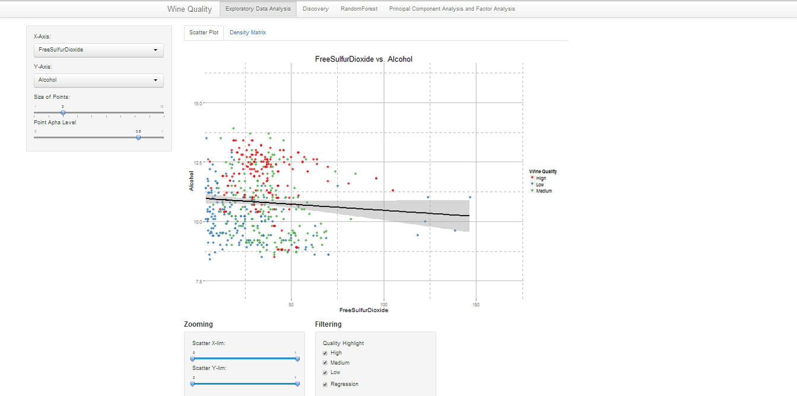
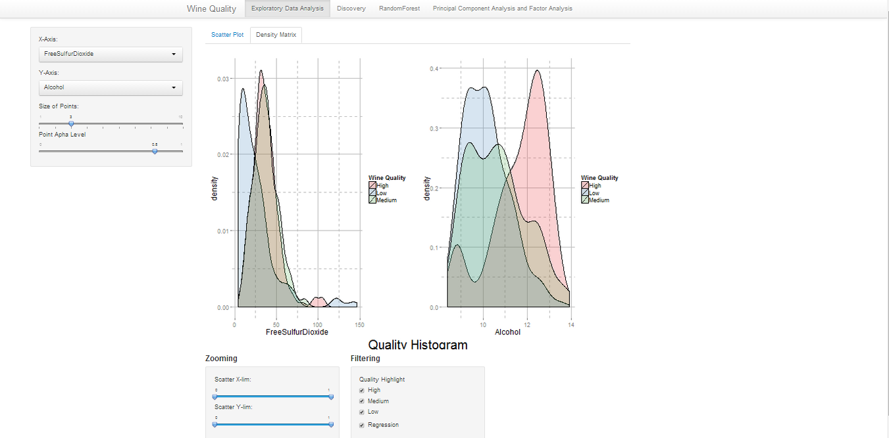
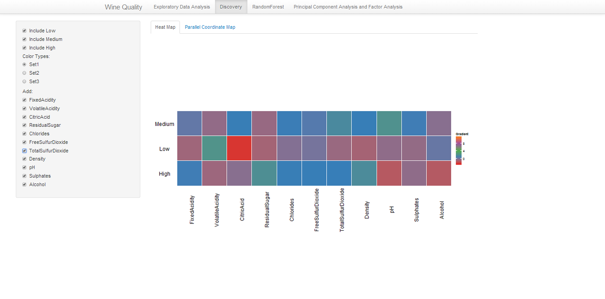
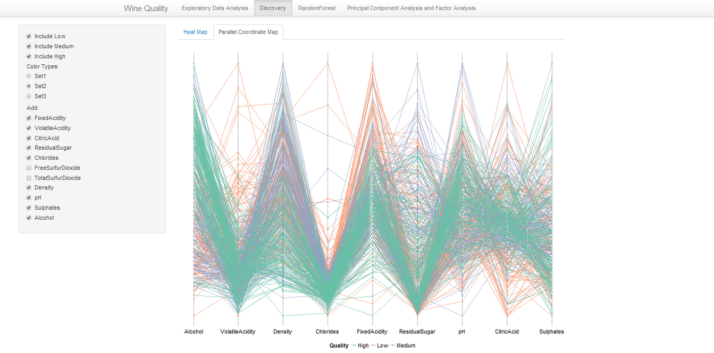
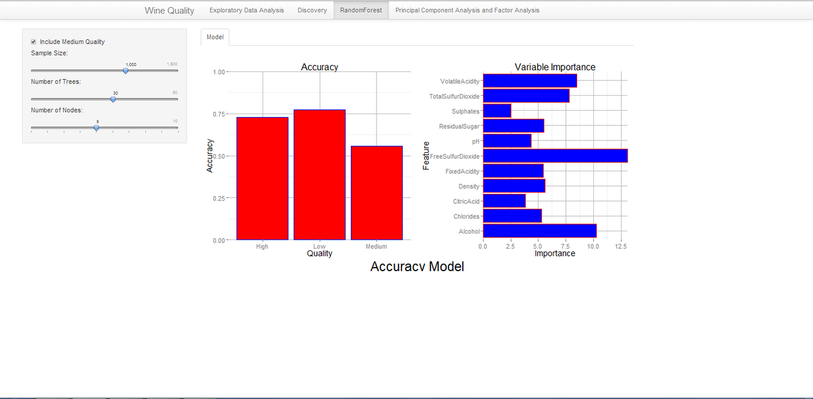

Project: Wine Quality
==============================

## Instructions ##

In order to run my shiny application, please install:
`shiny``ggplot2``scales``grid``GGally``randomForest``gridExtra`
`MASS``klaR``cluster`
To run the code please type below into your R-Browser:
`shiny::runGitHub("R_Visualization", "heyi87", subdir = "WineStudy")`

## Discussion ##

#Data - White Wine#

This data set comes from UCI machine learning repository. The data consist of 11 features including: Fixed Acidity, Volatile Acidity, Citric Acid, Residual Sugar, Chlorides, Free Sulfur Dioxide, Total Sulfur Dioxide, Density, and PH. There were 3898 different white wines and their quality rating. The rating ranges from 3 to 9. I decided to pick the white wine data set since it contains more low rating and high rating wines. Additionally, to improve the visualization of the data set, I change the  for quality of each wine:
•	For quality between 3-4, I give this wine a ‘low’ quality
•	For quality between 5-7, I give this wine a ‘medium’ quality
•	For quality 8-9, I give this win a ‘high’ quality
Also, since this data set is heavily skewed toward medium quality with more than 80% of the wine rated between 5-7. Therefore, I sample 180 wine from each of the quality: ‘low’, ‘medium’ and, ‘high’. This way my predictions and clusters will be evenly distributed. 

#Scatter Plot#

This is a scatter plot of the features colored by the quality of wine. The purpose of this plot is to show whether any two variables have any relationship with wine qualities. Also, this plot shows whether I can cluster the quality of wine by any two features. The user must pick any two features to put on the x axis and y axis. I use which()to subset by two variables. I used the quantile()to subset the data by quintile of the data set. If a user picked the same variable for both the y axis and x axis, the user will see an empty plot with large annotation to pick two different variables. For the filtering interactivity, I simply change the color when the user filters the data set.

The lie factor on this plot is close to 1 since this is a scatter plot. However, the user can pick the alpha and size of the dots. The lie factor will be the user’s discretion. Depending on the user’s choice of points size. Data ink ratio is high due to the size of the point. Data ink is high since users can zoom into the data set. 

This a good visualization if the user want to spot clusters in the data and outliers. Also, since the user can zoom in and out of the plot, and filter, the user can learn deeply about the data. However, I view this plot as an exploratory data analysis of the project. The user must pick between two features that he think are important for father investigating. 

In this plot, I learned that it is very difficult to cluster between medium, low, and high quality wine. However, once a user only look at low and medium quality wine, there is clear distinction. Also, the best features for cluster are alcohol and free sulfur dioxide. 

#Density Matrix#

This is a density plot, similar to histogram but the data the area under the plot is 1 . First if a user picks the same variable for plot on the left and right side of the axis, the plot will produce an empty annotation to pick different variables. I used quantile() function to subset the data by percentile when the user wants to zoom into the data set. The zooming part is by percentile of the data not the absolute value on the axis.  I used which() function to subset the left and right density plots features to be plotted. As for filtering, I change the color to empty when the user filter by that quality.

Since the data is sampled with 180 samples of each wine quality, the lie factor is close to 1. There is high data density since this is a density plot, since if the user zoom into the data set, the area under the plot will be reformatted to 1. However, this is beneficial since the user can have a better idea where the data lay during that zoom. This plot has high data ink. Due to the nature of the density plot, this plot has high data ink.

This visualization is great to see the distribution of the quality of wine on a particular feature. This plot is great to get a deeper understanding of how the quality of wine is distributed for each feature. The user can zoom into the data by percentile in the zooming box or filter by quality in the filtering box. Additionally, the density matrix is directly reflective of the scatter plot. The feature picked for the x-axis on the scatter plot will show up on the left density plot. The feature picked for the y-axis will be on the right side of the density. 

From this visualization, I learned that it is difficult to classify between low, high, and medium quality of wine. However, if I only look at the distribution between high and low quality wine, there is a clear distinction. Also there is a clear median distinction between low and high quality wine for free sulfur dioxide and alcohol features. 

#Heat Map#

This is a heat map. First the data is scaled since the variation of each feature is great. Since the user can subset by how many qualities to wine to include the data goes through a series of conditional statement to subset the data by quality accordingly. If the user does not pick any wine quality, the plot will output an empty graph with an annotation error message to pick at least 1 type of wine. Additionally, the user can pick how many features to include in the heat map.   I used a check box group and subset using the ‘%in%’ command in R. When a user checks a series of boxes, there will be a vector of numeric values into the R. This will in turn with an index trick to change into a set of column names to be added to the data to be plotted. After, the data is melted by the wine quality column and imputed into a geom_tile() in ggplot. The user can pick which color to plot the heat map using scale_fill_gradient function. 

Since the data is scaled before inputted in the plot, there is a low lie factor. A change in the variable or including an outlier in the plot will not dramatically change the output of the heat map. Additionally, the data density will change based on the number of quality and features the user wishes to see. There is very high data ink ratio for this heat map since this is the standard for a heat map.

A heat map is a great visualization for patterns. For my purpose, in the exploratory data analysis part the user can only see two features plotted at once. However, in a heat map, the user can see all of the features versus the quality at once. This is a very powerful visualization for the user to immediate distinguishes which features can be a divide the quality of wine. 

From this plot, I see that residual sugar or volatile acidity can be potential features to distinguish between features. Also by looking at a small subset of features, I can distinguish side by side which features is an important feature to distinguish between wine quality.

#Parallel Coordinate#

In the parallel coordinate plot, in order to see some difference between qualities, the user must have all the qualities of wine to be plotted. Therefore, if a user unclick any of the wine quality, an empty plot with annotation to ask the user to click all three plots.  The user can pick which features to plot. I used a check box group and subset using the ‘%in%’ command in R. When a user checks a series of boxes, there will be a vector of numeric values into the R. This will in turn with an index trick to change into a set of column names to be added to the data to be plotted. If the user has clicked less than 2 features, an employ plot with annotation to include more features in the plot will be returned. Also using the brewer_pal() in ggplot() to change the color of the plots. 

This plot has very high data ink since every row of data is plotted. Additionally, there is high data density. Many data points overlaps in this plot. The lie factor of this plot is low but the scale of the each feature is standardized. 
This plot give an overview of the overall data set and the trend between features of the quality of the wine groups. This plot is very good at grouping plots. Additionally, this plot can show outliers. It can clearly show whether there are numerous outliers grouped together in a quality. 

This plot is compact but it shows a general trend of quality of wine through features. There is a general trend for high quality wine. The wine qualities are grouped within alcohol, density, chlorides, pH, and free sulfur dioxide. However, this plot also shows outliers, it clearly indicate whether a wine is an outlier and how many wine from a particular wine quality group are outliers. 

#Random Forest#

For the modeling aspect of the project, I want to see whether a Random Forest model can predict the quality of the wine by the features. Also, the Randomforest package provide a variable important plot, this plot uses a gini calculation to see which variables are the most important for this model.  To learn more about random forest please see the Wikipedia article: http://en.wikipedia.org/wiki/Random_forest

Therefore, I created a button to allow the user to use either the medium quality wine in the model to improve the accuracy of the model. I use the subset() function in R in a conditional statement to remove the medium quality wine from the data set. Next, I wanted to provide two plots, one explaining the accuracy of the model and the next the variable importance plot. I run the random forest model to regress quality against all the other features. Using the output from the model, an accuracy result and variable important results, I plotted the accuracy of the model by quality and the importance of the variables in bar plots. I used the Gridextra package to put two plots together. 

There is high data ink in both of these plots. Since these are bar plots, majority of the ink of the plot is used on the bars to show data. Also no ink is wasted on any other graphics other than data presentation.  As for data density, there is high data density in the plot. For lie factor, both plot starts on the 0 axis and on the same scale. The accuracy bar plot compares accuracy between different qualities while the importance plot compare the importance of variables in the gini scale. Therefore, the lie factor is close to 1. 

This visualization is important for understanding the data set and finding which features are the most important. Also, this visualization shows that using the features in the data we can accurately predict the data. The accuracy bar plot shows the random forest’s accuracy of prediction for each of the quality level of wine and the right side of shows which variable is important for the model. The user can pick the sample size, number of trees, and number of nodes for the model. 

This model proved that we can use a random forest model to predict the accuracy of the quality of the wine. Including the all the quality of the wine, the random forest can have an accuracy of more than 75% for the high and low quality wine. As for the medium quality wine, including all the data, the random forest model can have over 50% accuracy. The most important observation occurs when the user removes the medium quality wine. The accuracy for high and low quality wines changes from 75% to 95%. This is an astonishing find, by removing the medium quality wine, we can improve the prediction of quality by the features of the data by 20%. Also in every variation of the model, the most important variables are volatile acidity, free sulfur dioxide and alcohol. This is validated by the previous data exploration section of the project. 

#Principal Component Analysis#
[!IMAGE](pca.png)

Since this is a clustering problem, I decided to put the data through a Principal Component Analysis.  Principal component analysis uses orthogonal transformation to group correlated variables into linear variable called principal components. The first principal component can explain most of the variance of the data. The user can plot different principal components with each other to better cluster the data. To learn more about principal component analysis please see wikipedia’s article on principal component analysis: http://en.wikipedia.org/wiki/Principal_component_analysis

For the data transformation, first I created numerous conditional statements to subset the data by quality. This will let the user pick which quality of wine will go into the principal component analysis. Second, I introduce an empty plot with annotation when the user pick none of the quality, this reminds the user to pick at least one quality type. Second, I use the princomp() function in the stats package to evaluate the principal component analysis. Once the function is evaluated, I print out the loading output. This loading shows how the original data is transformed by the loading. The loading come from taking the eigenvector from taking the eigenvalues of the variance covariance matrix of the data set. These loading values are multiplied to the original data to transform the data. The user can pick which principal components to plot; I used a series of conditional statements to subset the data to be plotted. Next I plotted the user chosen scores on both the x axis and y axis. Additionally, I collected the R output of the loadings and plotted it along with scatter plot. This lets the user see which features are contributing to more of the scores. I use the melt() function to plot the R output in a bar plot and put two plots next to each other using the GridExtra library.

The lie factor is close to one in this plot. The left plot is a scatter plot while the right side is a bar plot. The bar plot is from the 0 value and no scaling on the values. The scatterplot is a direct scatter plot. There is high data ink ratio. All the of the link is used in the data representation on the plot. As for data density, to show clustering, there must be space on the plot to distinguish between the two groups. 

This visualization shows the output of the principal component analysis of the data set. This is useful in clustering the quality of data by different components. Also the loading bar plot, shows which variable contribute the most at which principal component. These two plots are valuable for clustering of the data set by quality. Principal component analysis is generally a powerful tool to cluster and separate data.

From the visualization, there is a clear clustering between low and high quality wine by the first and second principal components. Also, in the first and second principal component, total sulfur dioxide and free sulfur dioxide contribute the most to the clustering. 

#Factor Analysis#
[!IMAGE](factor.png)

Another clustering method is factor analysis. Factor analysis is a method to way to group correlated variables into factors. This method potentially lower the number of features and group them into important features. To learn more about factor analysis see the Wikipedia article on factor analysis: http://en.wikipedia.org/wiki/Factor_analysis

I used the factanal() function to do the factor analysis of the data set. I used a series of conditional statements to let the user pick which quality of wine to include in the analysis. Next, I return an empty plot in case the user picked no quality of wine. Again, I used subset in when the user pick which score to plot. The R output for loading is first published in a table, and later I plot the text loading scores in a scatter pot. The purpose of the loading, similar to principal component analysis, is to give weight to the original data set to help divide the data points. The scatter plot for the data points are plotted when the user pick which score to show.

The lie factor is close to 1, any effect on the plot from inter activity is directly shown on the plot. Second, the data density fit the clustering limitation. To show clear clustering between the two groups, there must be a large scatter plot. Finally there is high data ink, all ink is used to either give labels or directly show the data.

This visualization show the direct result of the data once it is transformed by factor analysis. The purpose of these plots is to show how factor analysis has transformed the data into clusters. The left plot directly show how the data has transformed into clusters. The right side of the plot shows the weights, loading, of each factor. 

Once again, total sulfur dioxide and free sulfur dioxide are the most important variables to distinguish the qualities of wine. Also, there is clear distinguish between low and high quality wines. 

##Inter Activity ##

Interactivity is important for the initial exploratory data analysis aspect of my final project. I primarily implemented two interactivity, zooming and filtering. 

Zooming allows the user to zoom into the scatter plot; this allows the user to better focus on the plot that he wants to see clearly. This is helps with improving data density and overcome some overlap issues. The user must filter by percentage since everything is scaled from 0 to 1 in the back-end of my visualization. This interactivity is active between the scatter plot and the density plot in the exploratory data analysis of the project. 

Filtering is important for the user to focus on a particular quality of wine in my data set. It solves the problem of overcoming high data density. For this particular plot, I wanted to show the importance of removing certain quality of wine to create better clustering of the scatter plots. In the back-end of my visualization, when the user filters away a quality, I change the color of all the data with that quality. This interactivity is active between the scatter plot and the density plot in the exploratory data analysis of the project. In the density plot, the filtering allows the user to see only the data density between the quality the user picks. This allow for a clear distinguish between high and low quality.

## Prototype Feedback ##

In the original prototype, I used the wine wine data set. I only included a scatter plot and a density plot. I included all the quality of the wine without data transformation. Next, I changed the size of the bubble to correlate with the quality of wine. Additionally, I give the user the option to add quality abbreviation on each data point. As for the density plot, I included all 8 qualities of wine on one density plot. Additionally, I give the user the choice of random sample certain percentage of the points. 

The feedback was very useful, since looking at all eight quailities was difficult, I group the quailities into Low, Medium, and High. Next I removed the size of the points, since color will provide enough information. Also, I added the ability for the user to pick size of the points, and alpha level to improve the visibility of the plot. Since the scatter plot plotted two features at once, I used the gridextra package to plot both of these features at once. This allow for a direct comparison between the two features. I also included heat map, parallel coordinate map, random forest, principal component analysis, and factor analysis in the final projec. 

The 

