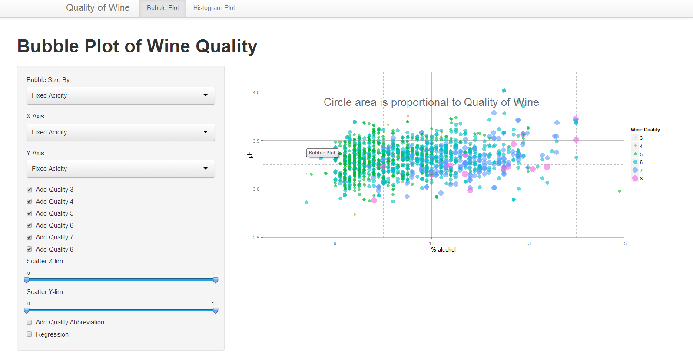
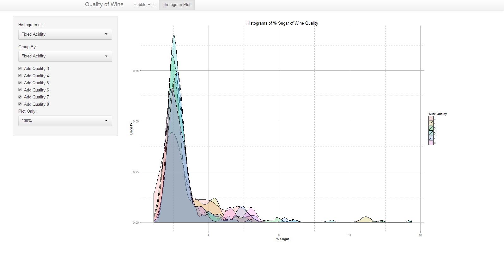

Project: Prototype
==============================

| **Name**  | Yi He  |
|----------:|:-------------|
| **Email** | yhe27@dons.usfca.edu |

## Instructions ##

In order to run my shiny application, please install:
`shiny`
`ggplot2`
To run the code please type below into your R-Browser:
`shiny::runGitHub("msan622", "heyi87", subdir = "project-prototype")`

## Discussion ##
### Data-Set ###
This data set contains 12 features and 4898 rows. This data set contains the red wine features of variants of the Portuguese 'Vinho Verde' wine. The features of the wine contains: fixed acidity, voltaile acidity, citric acid, residual sugar, chlorides, free sulfur dioxide, total sulfur dioxide, density, pH, sulphates, alcohol. The Dependent variales is quality with a score between 0 and 10. 

I would like to find a relationship between which features contribute the most to the quality of the variables. 

### Visualization 1 ###

My first visualization is a bubble plot. The user will be able to pick which feature go into the x axis, y axis, and bubble size. Ideally, the user will pick the bubble size as the quality of wine and see if there are clustering base on the two attributes. The user can also subset by quality of wine and zoom by the range of the axes. 

This visualization purpose is to see if there are clustering by the quality of wine by user defined features. 

### Visualization 2 ###

This visualization is a histogram. The user will be able to pick which features for the histogram, which feature to group by, and subsetting by wine quality. 

The purpose of this plot show whether a single attribute can determine the quality of wine. There maybe a single attribute that can determine the quality of the wine. 

