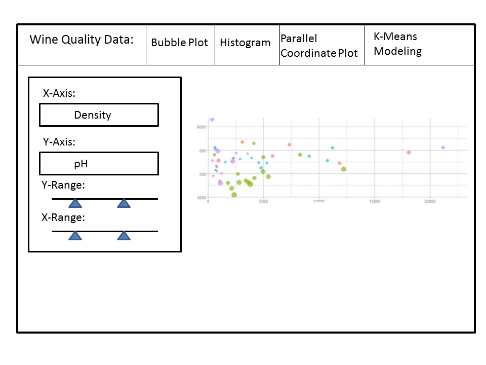
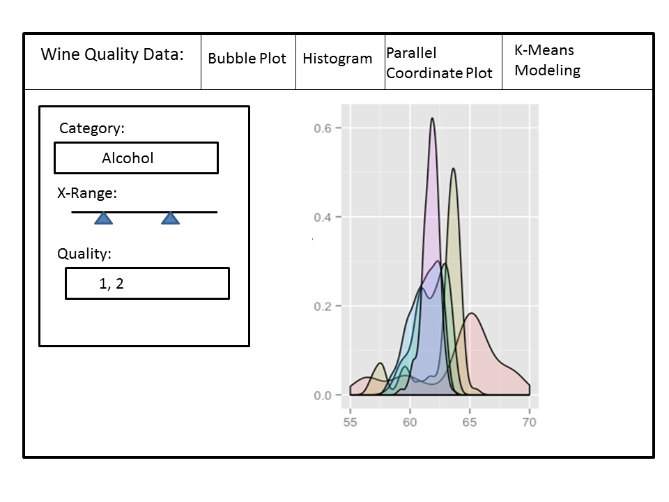
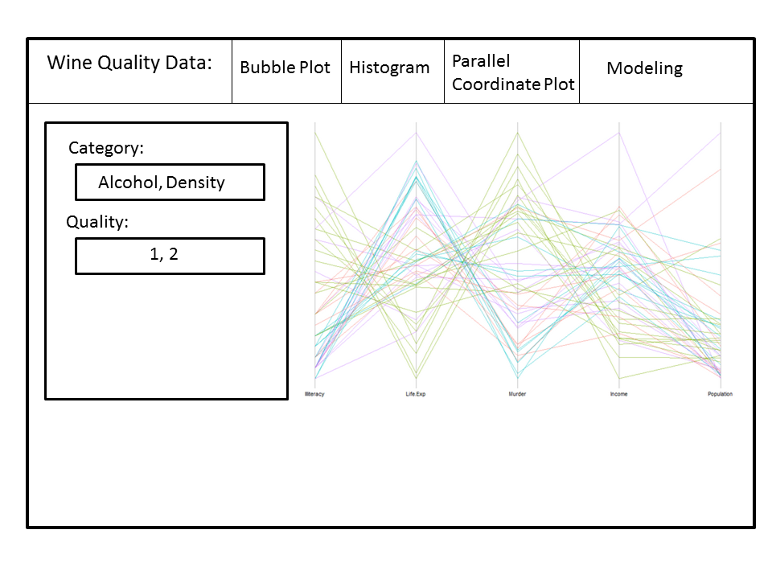
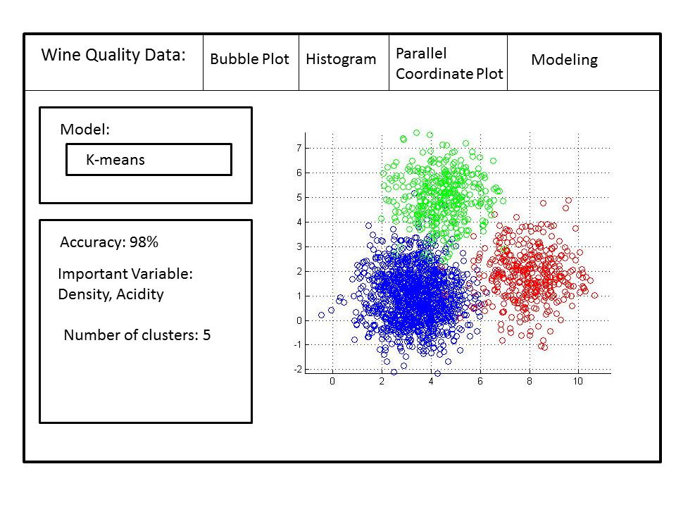

Project: Sketch
==============================

| **Name**  | Yi He  |
|----------:|:-------------|
| **Email** | yhe27@dons.usfca.edu |

#Project Sketch
==============================

I plan to study the quality of wine versus chemical features. I want to see if there are certain features that can predict the quality of wine. The data set contains 16,000 rows, 11 independent variables and a dependent variable. Each row is a brand of wine. 

#Planned Tools

I will be using a shiny application so the user can interact with the data set. For the final part of the interactivity, I will give the user the ability to model data set with quality of the wine as the dependent variable.
The packages I will be using are:

- `ggplot2`
- `shiny`
- `pamr` (modeling: k-means)
- `svm`  (modeling: svm)
- `stats` 
- `glm`  (modeling: logistic regression)

#Planned Techniques

I will create:

-Bubble Plot
For this visualization, the user will be able to pick from 11 independent variables to plot on either the x or y axis. Also, the user can zoom in or out from either of the axis. The user can change the size of the bubble by the quality of the wine. 

-Histogram
This visualization is meant for looking at the distribution between different qualities of wine for a particular independent variable. The user can plot 1 to 5 different qualities of wine on top of each other. The user can pick which axis to plot the frequency. 

-Parallel Coordinate Plot
This visualization is meant for the user to understand how quality of wine distributes throughout the independent variables. The user can pick how many of the independent variables can be plotted in the parallel coordinate plot. Additionally, the user can pick how many type of quality of wine will be plotted. 

-Modeling Visualization and Statistics
The user will pick between linear regression, logistic regression, SVM, or K-means for models. For the model, the dependent variables are the quality of the wine and the independent variables are the features of the data. The use will see a visualization of the model and a table of the statistics of the model.

#Planned Interaction

I will implement zooming for the user to zoom on the bubble plot. Also I will implement sorting to allow the user to sort quality of the wine.

#Planned Interface

